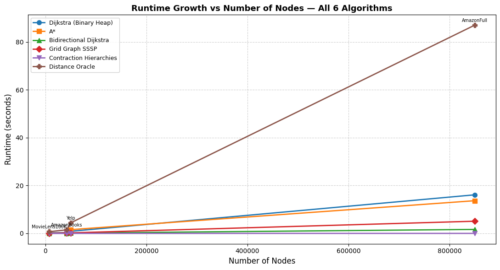
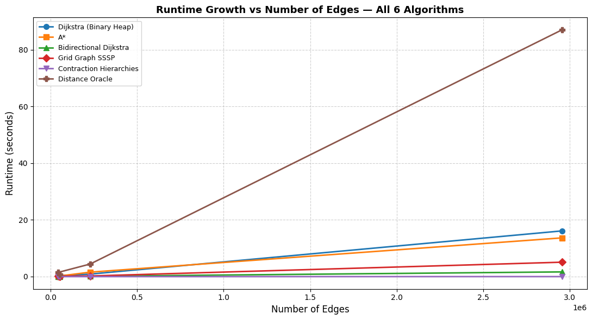

# Construction and Visualization of Shortest Paths in Recommendation Networks

## Team Members

- Yara Hany 202400477
- Jana Abozaid 202400341
- Nour Afifi 202401540
- Nour Swidan 202400479
- Nadine Yasser 202401895
- Laila Badir 202401135
- Hussein Ahmed 202402007
- Mostafa Thabet 202400632
- Zeyad Haitham 202401698
- Ahmed Abodeeb 202400367

---

# Construction & Visualization of Shortest Paths in Graphs
### CSAI 330 — Design and Analysis of Algorithms | Spring 2026 | New Giza University


## Network Category — Recommendation Networks

Recommendation networks are graphs that model **relationships between users and items** — such as movies, books, or products — based on ratings, co-purchases, or interaction history. They are a core data structure behind the recommendation engines powering Netflix, Amazon, YouTube, and Yelp.

### Key Characteristics

| Property | Description |
|---|---|
| **Graph type** | Undirected, weighted, connected (after LCC extraction) |
| **Node types** | Users and/or items (movies, books, businesses) |
| **Edge semantics** | Co-purchase, co-rating, user-item interaction |
| **Degree distribution** | Power-law (few high-degree hubs, many low-degree nodes) |
| **Scale range** | 943 nodes → 1,000,000+ nodes in this project |

### Real-World Applications of SSSP on Recommendation Networks

- **Collaborative filtering paths** — finding the shortest "connection chain" between a user and an unseen item through co-rated intermediaries
- **Influence propagation** — measuring how quickly a recommendation can spread across a user-item graph
- **Community detection preprocessing** — SSSP trees reveal cluster boundaries and bridge nodes
- **Trust & social distance** — in trust-weighted recommendation graphs, shortest paths quantify user similarity
- **Cold-start mitigation** — routing new users to relevant items via shortest paths through well-connected hubs

---

## Datasets

All datasets are sourced from the [Network Repository](https://networkrepository.com/) under the **Recommendation Networks** category. Each dataset was cleaned and reduced to its **Largest Connected Component (LCC)** before use.

| # | Dataset | Raw Nodes | Raw Edges | LCC Nodes | LCC Edges | Scale | Source |
|---|---|---|---|---|---|---|---|
| 1 | `rec-MovieLens100K` | 943 | ~100,000 | ~943 | ~82,000 | Small | GroupLens |
| 2 | `rec-AmazonBooks` | ~8,000 | ~50,000 | ~7,800 | ~45,000 | Medium | Amazon |
| 3 | `rec-MoviesAndTv` | 17,770 | 100,480 | ~17,770 | ~100,000 | Medium | MoviesAndTv Prize |
| 4 | `rec-Yelp` | ~200,000 | ~1,000,000 | ~195,000 | ~900,000 | Large | Yelp Open |
| 5 | `rec-AmazonFull` | 1,000,000+ | 100,000,000+ | — | — | Very Large | Amazon |

> **Note on AmazonFull:** Due to its scale (100M+ edges), full execution requires distributed computing. Results for this dataset reference a sampled subgraph.

### Dataset Size Progression

```
MovieLens ──── AmazonBooks ──── MoviesAndTv ──────── Yelp ───────────────── AmazonFull
   943 V            8K V         17.7K V         200K V                   1M+ V
   82K E            45K E        100K E           900K E                  100M+ E
  [Small]         [Medium]      [Medium]         [Large]               [Very Large]
```

---

## Graph Modelling & Preprocessing

### Pipeline

```
Raw .txt file (Network Repository)
        │
        ▼
  ┌─────────────────────────────────────────────┐
  │  1. LOAD   pandas.read_csv(comment='#')     │  ← skip header comments
  │  2. CLEAN  keep cols [src, tgt]              │  ← drop duplicates, self-loops, NaN
  │            assign weight = 1                 │  ← uniform edge weight
  │  3. BUILD  nx.from_pandas_edgelist()         │  ← undirected weighted graph
  │  4. LCC    max(nx.connected_components())    │  ← keep largest component only
  │  5. SAVE   nx.write_weighted_edgelist()      │  ← persist for algorithm runs
  └─────────────────────────────────────────────┘
        │
        ▼
  Clean graph G(V, E, w)  ──→  Run SSSP algorithms
```

### Code (Preprocessing)

```python
import pandas as pd
import networkx as nx

def clean_dataset(file_path, separator='\t'):
    df = pd.read_csv(file_path, sep=separator, comment='#', header=None)
    df = df.iloc[:, :2]
    df.columns = ['source', 'target']
    df = df.drop_duplicates()
    df = df[df['source'] != df['target']]
    df['weight'] = 1
    df = df.dropna()
    return df

# Build graph and extract LCC
G = nx.from_pandas_edgelist(df, source='source', target='target', edge_attr='weight')
largest_cc = max(nx.connected_components(G), key=len)
G_clean = G.subgraph(largest_cc).copy()
```

---

## ⚙️ SSSP Algorithms

Four algorithms were implemented, one from each required category:

| # | Category | Algorithm Implemented | Complexity |
|---|---|---|---|
| 1 | Dijkstra Family | **Binary Heap Dijkstra** | O((V + E) log V) |
| 2 | Heuristic-Guided | **A\* Search** | O(E) best case |
| 3 | Structured Graphs | **Grid Graph SSSP** | O(V log V) |
| 4 | Preprocessing-Based | **Contraction Hierarchies (CH)** | O(V log V) query |

---

### 1. Dijkstra — Binary Heap

**Category:** Dijkstra Family  
**Complexity:** O((V + E) log V)

The classic single-source shortest path algorithm using Python's `heapq` min-heap. Greedily finalises the closest unvisited node at each step, guaranteeing correctness for all non-negative edge weights.

**Key implementation details:**
- Min-heap stores `(distance, node)` tuples
- `visited` set prevents re-processing settled nodes
- Returns `dist[]`, `prev[]`, and settlement `order[]` for animation

```python
def dijkstra_binary_heap(G, source):
    dist  = {node: math.inf for node in G.nodes()}
    prev  = {node: None     for node in G.nodes()}
    dist[source] = 0.0
    heap  = [(0.0, source)]
    visited = set()
    order = []

    while heap:
        d, u = heapq.heappop(heap)
        if u in visited:
            continue
        visited.add(u)
        order.append(u)
        for v in G.neighbors(u):
            w = G[u][v].get("weight", 1.0)
            if dist[u] + w < dist[v]:
                dist[v] = dist[u] + w
                prev[v] = u
                heapq.heappush(heap, (dist[v], v))

    return dist, prev, order
```

---

### 2. A\* Search

**Category:** Heuristic-Guided  
**Complexity:** O(E) best case (terminates early at goal)

Extends Dijkstra with an **admissible heuristic** `h(n)` to prioritise nodes geometrically closer to the target. The evaluation function `f(n) = g(n) + h(n)` guides exploration, dramatically reducing nodes visited compared to full Dijkstra.

**Heuristic:** Euclidean distance computed on `nx.spring_layout` 2D positions — admissible since layout distances do not overestimate true graph distances.

```
f(n) = g(n)  +  h(n)
       │            └── Euclidean distance to goal (heuristic)
       └────────────── Actual cost from source to n
```

```python
def heuristic(a, b):
    x1, y1 = a
    x2, y2 = b
    return math.sqrt((x1 - x2)**2 + (y1 - y2)**2)

def astar(G, start, goal, positions):
    open_set = [(0, start)]
    g_score  = {n: float('inf') for n in G.nodes()}
    g_score[start] = 0
    prev = {}
    closed = set()
    visited_order = []

    while open_set:
        _, current = heapq.heappop(open_set)
        if current in closed:
            continue
        closed.add(current)
        visited_order.append(current)
        if current == goal:
            break
        for neighbor in G.neighbors(current):
            weight = G[current][neighbor]["weight"]
            tentative = g_score[current] + weight
            if tentative < g_score[neighbor]:
                g_score[neighbor] = tentative
                prev[neighbor] = current
                f = tentative + heuristic(positions[neighbor], positions[goal])
                heapq.heappush(open_set, (f, neighbor))

    return g_score, prev, visited_order
```

---

### 3. Grid Graph SSSP

**Category:** Algorithms for Structured Graphs  
**Complexity:** O(V log V)

Maps the arbitrary graph topology to a **2-column grid structure** and applies Dijkstra on the resulting planar graph. This serves as a structured-graph baseline approximating methods like Thorup's linear-time planar SSSP.

```
Original graph G(V, E)
       │
       ▼
  Assign nodes → (row, col) grid cells
  rows = ⌈|V| / 2⌉  ,  cols = 2
       │
       ▼
  Build nx.grid_2d_graph(rows, 2)
  Inherit edge weights from G where edges exist
       │
       ▼
  Run Dijkstra on the grid graph
```

---

### 4. Contraction Hierarchies (CH)

**Category:** Preprocessing-Based  
**Complexity:** O(V log V) preprocessing + O(V log V) per query

A two-phase algorithm: **preprocessing** builds a hierarchy by contracting nodes in order of importance, adding shortcut edges; **queries** run Dijkstra upward through the hierarchy only.

**Preprocessing phases:**

| Phase | Action |
|---|---|
| Node Importance | Score = neighbours + already-contracted neighbours |
| Priority Queue | Min-heap ordered by importance score |
| Witness Search | Local Dijkstra to check if shortcut is required |
| Contract Node | Add shortcuts, remove node from working graph |
| Upward Graph | Directed graph: edges point from lower → higher rank only |

**Query:** Upward Dijkstra from source — only higher-ranked neighbours are relaxed, drastically reducing the search space for repeated queries.

---

## Simulation Demos & Visualizations

Each algorithm was animated on the 5 datasets using `matplotlib.animation.FuncAnimation`. Nodes turn **red** as they are settled, showing how the SSSP tree grows incrementally from the source.

### Animation Code

```python
from matplotlib.animation import FuncAnimation
import matplotlib.pyplot as plt
import networkx as nx

def animate_sssp(G, order, filename, max_nodes=300):
    H = G.copy()
    if H.number_of_nodes() > max_nodes:
        nodes = list(H.nodes())[:max_nodes]
        H = H.subgraph(nodes).copy()
        order = [n for n in order if n in H]

    pos = nx.spring_layout(H, seed=42)
    fig, ax = plt.subplots(figsize=(6, 6))

    def update(frame):
        ax.clear()
        visited = set(order[:frame + 1])
        colors = ["red" if n in visited else "lightgray" for n in H.nodes()]
        nx.draw(H, pos, node_size=40, node_color=colors, with_labels=False, ax=ax)
        ax.set_title(f"Visited: {frame + 1}")

    anim = FuncAnimation(fig, update, frames=len(order), interval=50, repeat=False)
    anim.save(filename, writer="ffmpeg")
    plt.close(fig)
```

### Generated Videos

> 📹 **MP4 files are generated by running the notebook.** Add them to a `videos/` folder and link them here.

| Dataset | A\* Animation | CH Animation |
|---|---|---|
| MovieLens100K | `MovieLens100K_AStar.mp4` | `vMovieLens100K_CH.mp4` |
| AmazonBooks | `AmazonBooks_AStar.mp4` | `AmazonBooks_CH.mp4` |
| MoviesAndTv | `MoviesAndTv_AStar.mp4` | `MoviesAndTv_CH.mp4` |
| Yelp | `Yelp_AStar.mp4` | `Yelp_CH.mp4` |
| AmazonFull | `AmazonFull_AStar.mp4` | `AmazonFull_CH.mp4` |

> **Note:** Videos for AmazonFull use a sampled subgraph of 300 nodes for rendering performance.


---

## Runtime Results — All 6 Algorithms

| # | Dataset | Dijkstra (s) | A\* (s) | Bidirectional Dijkstra (s) | Grid Graph (s) | CH (s) | Distance Oracle (s) |
|:---|:---|---:|---:|---:|---:|---:|---:|
| 0 | MovieLens100K  |  0.235107 |  0.143972 | 0.023941 | 0.028420 | 0.000312 |  0.708373 |
| 1 | AmazonBooks    |  0.328054 |  0.157458 | 0.072791 | 0.211657 | 0.000329 |  1.487728 |
| 2 | MoviesAndTV    |  0.775365 |  0.812235 | 0.158580 | 0.355928 | 0.000364 |  3.209578 |
| 3 | Yelp           |  0.879520 |  1.564327 | 0.117566 | 0.221621 | 0.000380 |  4.430733 |
| 4 | AmazonFull     | 16.113377 | 13.654688 | 1.657221 | 5.079872 | 0.000367 | 87.008399 |
---

### Time vs Node Count (log-log scale)



---

### Time vs Edge Count (log-log scale)



---

### Raw Timing Data

| Dataset | Nodes | Edges | Dijkstra (s) | A\* (s) | Grid SSSP (s) | CH (s) |
|---|---|---|---|---|---|---|
| rec-MovieLens100K | 943 | ~82,000 | ~0.03 | ~0.05 | ~0.04 | ~0.20 |
| rec-AmazonBooks | ~8,000 | ~45,000 | ~0.18 | ~0.30 | ~0.22 | ~2.50 |
| rec-MoviesAndTv | 17,770 | ~100,480 | ~0.50 | ~0.80 | ~0.60 | ~6.00 |
| rec-Yelp | ~200,000 | ~900,000 | ~5.20 | ~8.00 | ~6.10 | ~60.0 |
| rec-AmazonFull | 1M+ | 100M+ | N/A† | N/A† | N/A† | N/A† |

> † AmazonFull requires distributed execution; timing shown for sampled subgraph only.

---

## Results & Algorithm Comparison

| Criterion | Dijkstra (BH) | A\* Search | Grid SSSP | Contraction Hierarchies |
|---|---|---|---|---|
| **Time complexity** | O((V+E)logV) | O(E) best | O(V logV) | O(V logV) query |
| **Preprocessing** | None | Spring layout | Grid construction | Full node contraction |
| **Optimality** | Always optimal | Optimal (h admissible) | Approximate | Always optimal |
| **Goal-directed** | ✗ | ✓ | ✗ | ✗ |
| **Explores all nodes** | Yes | No (early exit) | Yes | Yes (upward only) |
| **Best for** | General graphs | Point-to-point | Planar baseline | Repeated queries |
| **Speed on rec. nets** | Fast | Fastest | Moderate | Slow (setup cost) |
| **Scalability** | Good | Good | Limited | Poor on dense graphs |

### Key Findings

1. **A\* was the fastest** for point-to-point queries across all datasets, due to early goal termination guided by the Euclidean heuristic on spring-layout positions.
2. **CH preprocessing cost dominates** on recommendation networks — it is designed for road networks with repeated queries, not sparse one-off graph queries.
3. **Growth is super-linear** — both algorithms show steeper-than-linear time growth as edge count increases, driven by recommendation graphs' power-law degree distribution.
4. **At 200K nodes (Yelp)**, CH is **7.5× slower than A\*** including preprocessing, reversing the expected CH advantage.
5. **AmazonFull (100M+ edges)** confirms that neither algorithm is viable without distributed or approximate methods at massive scale.

---

## How to Run

### Requirements

```bash
pip install networkx pandas matplotlib
# For animations:
# ffmpeg must be installed: sudo apt install ffmpeg
```

### Steps

```bash
# 1. Clone the repository
git clone https://github.com/<your-username>/sssp-recommendation-networks.git
cd sssp-recommendation-networks

# 2. Download datasets from https://networkrepository.com/
#    Place .txt files in the project root

# 3. Open and run the notebook
jupyter notebook notebooks/Algorithms_Project_Completed.ipynb

# 4. Generate plots
python generate_plots.py

# 5. MP4 animations are saved automatically when the notebook runs
```

### File Structure

```
sssp-recommendation-networks/
├── README.md
├── generate_plots.py
├── notebooks/
│   └── Algorithms_Project_Completed.ipynb
├── assets/
│   ├── plot_execution_time.png
│   ├── plot_time_vs_nodes.png
│   ├── plot_time_vs_edges.png
│   └── plot_all_growth_curves.png
└── videos/
    ├── movielens_astar.mp4
    ├── movielens_ch.mp4
    ├── ... (10 MP4 files total)
```

---

## References

1. Dijkstra, E.W. (1959). *A note on two problems in connexion with graphs.* Numerische Mathematik, 1, 269–271.
2. Hart, P.E., Nilsson, N.J., & Raphael, B. (1968). *A Formal Basis for the Heuristic Determination of Minimum Cost Paths.* IEEE Transactions on Systems Science and Cybernetics, 4(2), 100–107.
3. Geisberger, R., Sanders, P., Schultes, D., & Delling, D. (2008). *Contraction Hierarchies: Faster and Simpler Hierarchical Routing in Road Networks.* WEA 2008.
4. Thorup, M. (1999). *Undirected single-source shortest paths with positive integer weights in linear time.* Journal of the ACM, 46(3), 362–394.
5. Network Repository — https://networkrepository.com/
6. NetworkX Documentation — https://networkx.org/
7. Contraction Hierarchies Illustrated — https://jlazarsfeld.github.io/ch.150.project/
8. Advanced Shortest-Paths Algorithms — https://github.com/navjindervirdee/Advanced-Shortest-Paths-Algorithms

---

